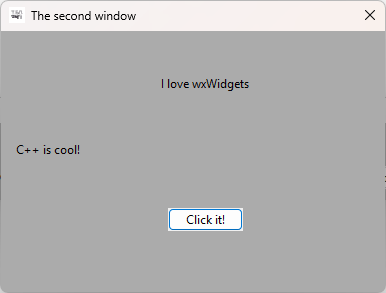

# DialogBlocksWinAppML
Пример мультиязычной визуальной программы на C++ с использованием wxWidgets и DialogBlocks в Visual Studio 2022





***DialogBlocksWinAppMLapp.h:***

```
class DialogBlocksWinAppMLApp : public wxApp
{

public:
	// --- Создать объект локализации приложения для подсистемы wxWidgets ---
	wxLocale m_locale; 

```

***DialogBlocksWinAppMLapp.cpp:***

```
// --- Объявление указателя на объект конфигурации ---
wxFileConfig* m_fileconfig;

```
```
// Инициализация приложения
void DialogBlocksWinAppMLApp::Init()
{
	// --- ЛОКАЛИЗАЦИЯ ПРИЛОЖЕНИЯ, ЧТЕНИЕ ИЗ ФАЙЛА НАСТРОЕК ---

	// Добавить путь к каталогу с переводами в список поиска каталогов с переводами
	m_locale.AddCatalogLookupPathPrefix(wxT("locale"));

	// Создать имя для файла конфигурации приложения
	wxFileName fn = wxFileName(wxPathOnly(wxStandardPaths::Get().GetExecutablePath()), GetAppName(), wxT("ini"));

	// Создать объект конфигурации приложения
	m_fileconfig = new wxFileConfig(wxEmptyString, wxEmptyString, fn.GetFullPath(), wxEmptyString,
		wxCONFIG_USE_LOCAL_FILE | wxCONFIG_USE_NO_ESCAPE_CHARACTERS);

	wxConfigBase::Set(m_fileconfig); // Установить объект конфигурации приложения

	wxString user_lang; // Объявить переменную для хранения языка пользователя

	if (m_fileconfig) { // Если объект конфигурации приложения создан
		user_lang = (m_fileconfig->Read(wxT("language"), wxT("en"))); // Прочитать язык пользователя из конфигурации

		if (user_lang == L"ru") // Если язык пользователя русский
		{
			setlocale(LC_ALL, "ru_RU.UTF-8"); // Установить локаль по умолчанию для Linux на русский язык
			m_locale.Init(wxLANGUAGE_RUSSIAN); // Установить локализацию приложения на русский язык
			m_locale.AddCatalog(wxT("ru")); // Добавить каталог с переводами на русский язык	
		}
		else
			if (user_lang == L"de") // Если язык пользователя немецкий
			{
				setlocale(LC_ALL, "de_DE.UTF-8"); // Установить локаль по умолчанию для Linux на немецкий язык
				m_locale.Init(wxLANGUAGE_GERMAN); // Установить локализацию приложения на немецкий язык
				m_locale.AddCatalog(wxT("de")); // Добавить каталог с переводами на немецкий язык
			}
			else
			{
				setlocale(LC_ALL, "en_US.UTF-8"); // Установить локаль по умолчанию для Linux на английский язык
				m_locale.Init(wxLANGUAGE_ENGLISH); // Установить локализацию приложения на английский язык
			}
	}
}
```

```
// Выход из приложения
int DialogBlocksWinAppMLApp::OnExit()
{
	// --- СОХРАНИТЬ НАСТРОЙКИ В ФАЙЛ КОНФИГУРАЦИИ ПРИ ВЫХОДЕ ИЗ ПРОГРАММЫ ---
	if (m_fileconfig) { // Если объект конфигурации приложения создан
		m_fileconfig->Flush(); // Сохранить настройки в файл
		delete m_fileconfig; // Удалить объект конфигурации приложения
		m_fileconfig = NULL; // Установить указатель на объект конфигурации приложения в NULL
	}
	wxConfigBase::Set(NULL); // Установить объект конфигурации приложения в NULL
	// ------------------------------------------------------------------

	return wxApp::OnExit(); // Вызвать функцию OnExit() базового класса
}
```

***form1.cpp:***

```
// Конструктор создания формы
Form1::Form1(wxWindow* parent, wxWindowID id, const wxString& caption, const wxPoint& pos, const wxSize& size, long style) {
	Init();
	Create(parent, id, caption, pos, size, style);

	// --- Загрузить настройки из конфигурации и установить значения в визуальных компонентах ---
	wxConfigBase* conf = wxConfigBase::Get(false); // Получить объект конфигурации приложения
	if (conf) { // Если объект конфигурации приложения создан
		wxString user_lang = (conf->Read(wxT("language"), wxT("en"))); // Прочитать значение языка из конфигурации
		wxChoice* cl = (wxChoice*)FindWindowById(Choice_Lang); // Найти компонент с выбором языка
		if (cl) { // Если элемент найден
			cl->SetStringSelection(user_lang); // Установить язык в компоненте
		}
	}
	this->SetTitle(_("Multilingual program")); // Установить имя приложения на выбранном языке
}
```

```
// Обработчик события нажатия на кнопку
void Form1::OnButton1Click(wxCommandEvent& event) {
	wxMessageBox(_("Hello")); // Выдать локализованное сообщение
}
```

```
// Обработчик закрытия окна
void Form1::OnCloseWindow(wxCloseEvent& event) {
	// --- Сохранить настройки из визуальных компонент в конфигурацию ---
	wxConfigBase* conf = wxConfigBase::Get(false); // Получить объект конфигурации приложения
	if (!conf) return; // Если объект конфигурации приложения не создан, то выход
	wxChoice* cl = (wxChoice*)FindWindowById(Choice_Lang); // Найти компонент с выбором языка
	if (cl) { // Если компонент найден
		conf->Write(wxT("language"), cl->GetStringSelection()); // Записать значение из компонента в конфигурацию
	}
	Destroy(); // Закрыть окно
}
```

```
// Обработчик события выбора языка
void Form1::OnChoiceLangSelected(wxCommandEvent& event) {
	wxMessageBox(_("Restart the program")); // Выдать локализованное сообщение
}

```


## Ссылки:

http://www.anthemion.co.uk/dialogblocks/

https://www.wxwidgets.org/

https://visualstudio.microsoft.com/ru/vs/community/

http://www.anthemion.co.uk/dialogblocks/ImageBlocks-1.07-Setup.exe

https://poedit.net/
